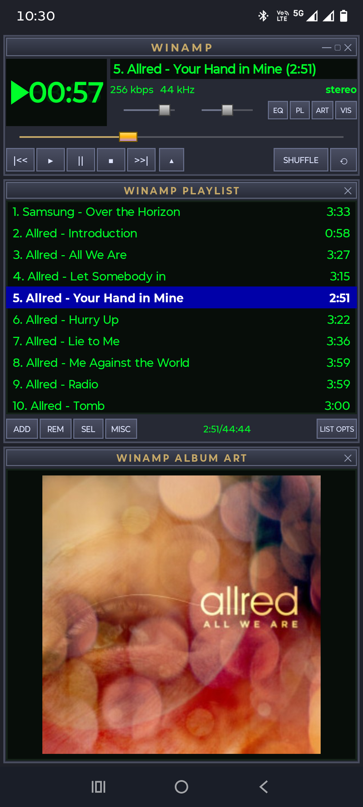

# ⚡ AndAmp - Winamp Classic Android Music Player

A full-featured Android music player with an authentic 90s **Winamp Classic** skin interface, complete with retro green LED displays, scrolling title marquees, playlist manager with M3U support, 10-band equalizer with presets, dynamic Milkdrop 2 audio visualizer, MP3 album art viewer, and background playback with lock screen media controls.



---

## ✨ Features

### 🎛️ Winamp Main Player Window
- **Retro LED Time Clock**: Glowing green digital LED digits (`00:00`) with active play/pause indicators (`▶`/`||`).
- **Scrolling Title Marquee**: Monospace retro green text marquee displaying song title, artist, and track index.
- **Audio Spec Badges**: Live display of bitrate (`kbps`), sample rate (`kHz`), and channels (`stereo`/`mono`).
- **Metallic Sliders**: Custom metallic volume slider, balance slider (L/R), and main track seek bar with iconic gold handle.
- **Classic Transport Buttons**: `|<<` (Previous), `▶` (Play), `||` (Pause), `■` (Stop), `>>|` (Next), `▲` (Eject/Add), `SHUFFLE`, and `REPEAT`.
- **Sub-Window Toggles**: `EQ`, `PL`, `ART`, and `VIS` buttons to toggle Equalizer, Playlist, Album Art, and Visualizer sub-windows.

---

### 📜 Winamp Playlist Manager
- **Monospace Retro Tracklist**: Retro green text with durations.
- **Winamp Selection Banner**: Selected track is highlighted in iconic bright Winamp blue (`#0000A8`) with bold white text.
- **Action Toolbar Buttons**:
  - **`ADD`**: Pop-up menu to add individual **Files** or scan entire **Folders** recursively using Android Storage Access Framework (SAF).
  - **`REM`**: Removes selected tracks from playlist.
  - **`SEL`**: Select **All** tracks or jump to **Current** active track.
  - **`MISC`**: View detailed **File Info** metadata or **Sort by Title** alphabetically.
  - **`LIST OPTS`**: **Save Playlist (.m3u)**, **Clear Playlist**, or **Load Playlist (.m3u)**.
- **Live Playlist Stats**: Shows active track time / total combined playlist duration (`MM:SS / HH:MM:SS`).

---

### 🎚️ Winamp 10-Band Equalizer
- **10 Vertical Sliders**: `60Hz`, `170Hz`, `310Hz`, `600Hz`, `1kHz`, `3kHz`, `6kHz`, `12kHz`, `14kHz`, `16kHz` (`+12dB` to `-12dB`).
- **Live Audio Frequency Tuning**: Integrated with Android `Equalizer` effect API for real-time sound processing.
- **Presets Selector**: Includes built-in presets: *Flat, Rock, Pop, Techno, Dance, Soft, Classical, Full Bass*.

---

### 🌌 Milkdrop 2 Dynamic Visualizer
- Dynamic real-time procedural canvas animating fluid synthwave nebulas, frequency spectrum bars, and response waveforms synchronized with playing audio.
- Tap panel to cycle through visualizer modes.

---

### 🖼️ MP3 Album Art Viewer
- Extracts embedded album cover artwork using `MediaMetadataRetriever` and renders high-quality framed art.

---

### 🎧 Background Playback & Lock Screen Controls
- **Foreground Service**: Audio continues playing smoothly in the background when app is minimized or phone is locked.
- **System Media Notification**: Spotify-style notification with interactive Previous, Play/Pause, Next controls, progress bar, album art, and lock screen integration.
- **Persistent State**: Playlist tracks and current playback position persist seamlessly when returning to the app.

---

## 🚀 Building & Running

### Prerequisites
- JDK 17 or JDK 21 (e.g. Android Studio embedded JBR)
- Android SDK Api 34+

### Build Debug APK
```bash
./gradlew assembleDebug
```
The compiled APK will be available at:
`app/build/outputs/apk/debug/app-debug.apk`

---

## 📄 License
This project is open source and distributed under the MIT License.
